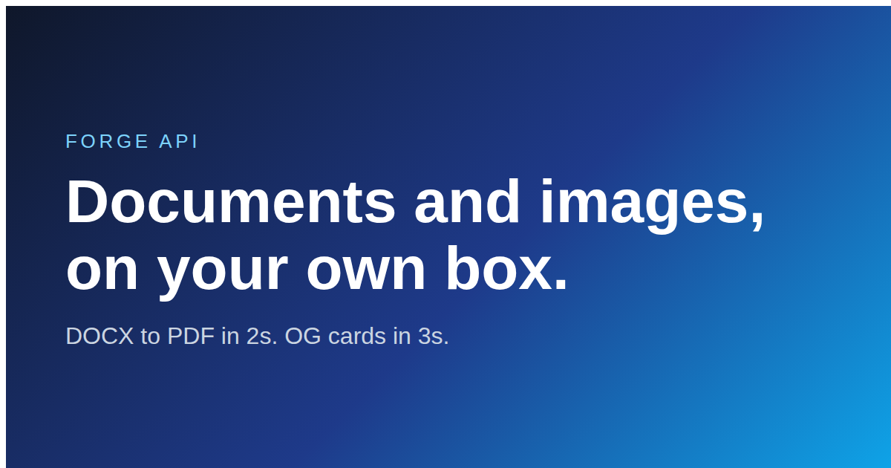

<h1 align="center">Forge</h1>

<p align="center">
  <strong>Self-hosted document conversion and image rendering API —<br>
  with API keys, quotas and usage metering built in.</strong>
</p>

<p align="center">
  <a href="https://github.com/7DedSins/docforge/actions/workflows/ci.yml"></a>
  
  
  
  
</p>

---

Forge turns files into other files, over HTTP.

Send it a Word document, get a PDF. Send it HTML, get a PDF or a PNG. Send it
several PDFs, get one back.

[Gotenberg](https://gotenberg.dev) already does that conversion brilliantly —
but it has no concept of *users*. No API keys, no limits, no record of who
called what. That's fine inside your own network, and useless the moment you
want to let anyone else use it.

**Forge is the missing layer.** Issue a key, cap it at N calls a month, log
every call, and stop a traffic spike from taking the host down. One
`docker compose up` and you have a document API you can actually hand out.

<p align="center">
  
</p>

<p align="center"><sub>Rendered by Forge in 2.9s from an HTML template and a JSON payload.</sub></p>

## Quick start

```bash
git clone https://github.com/7DedSins/docforge && cd docforge
cp .env.example .env    # set FORGE_DOMAIN to your hostname
docker compose up -d
docker exec forge-gateway python /app/forgectl.py issue --label me --plan pro
```

That's the whole install. No database server, no message queue, no cloud
account, no API keys to sign up for.

## What it does

| Method | Endpoint | Does |
|---|---|---|
| `POST` | `/v1/convert/office` | DOCX, XLSX, PPTX, ODT, RTF, CSV → PDF |
| `POST` | `/v1/convert/html` | HTML → PDF |
| `POST` | `/v1/pdf/merge` | Merge PDFs into one |
| `POST` | `/v1/image/render` | HTML template + JSON → PNG / JPEG / WebP |
| `GET` | `/v1/usage` | Calls used this month |
| `POST` | `/mcp` | The same four tools, as an MCP server |

### Convert a document

```bash
curl -X POST https://your-host/v1/convert/office \
  -H "Authorization: Bearer $FORGE_KEY" \
  -F "file=@report.docx" -o report.pdf
```

### Render an image from a template

```bash
curl -X POST https://your-host/v1/image/render \
  -H "Authorization: Bearer $FORGE_KEY" \
  -H "Content-Type: application/json" \
  -d '{
    "template": "<div style=\"width:1200px;height:630px;display:flex;align-items:center;justify-content:center;background:#0f172a;font-family:sans-serif\"><h1 style=\"color:#fff;font-size:72px\">{{ title }}</h1></div>",
    "data": { "title": "Hello world" },
    "width": 1200, "height": 630
  }' -o og.png
```

Templates are Jinja2 with autoescaping on, so user-supplied data can't break
out of the layout or inject markup.

### Use it from an AI agent

Point any MCP client at `https://your-host/mcp`. Four tools are exposed:
`html_to_pdf`, `render_image`, `convert_office_document`, `merge_pdfs`.

## Why self-host

Hosted document APIs bill per call — commonly around **$0.08 per document**,
and up to $49 per 1,000 images. A workflow firing 20,000 conversions a month is
a $1,600 line item. The same workload on a $6/month VPS costs $6.

The other reason is that your documents stop leaving your infrastructure.

## Performance

Measured on 4 vCPU / 8 GB, sharing the box with other services.

| Operation | Time |
|---|---|
| HTML → PDF | 1.3 s |
| DOCX → PDF | 2.0 s |
| 1200×630 PNG | 2.9 s |

Under load — 20 concurrent HTML→PDF:

```
succeeded  : 20/20 (100%)
wall clock : 3.6 s
throughput : 5.63 docs/sec
latency p50: 2.38 s
```

Requests beyond the concurrency limit **queue** rather than fail, so overload
shows up as latency instead of errors — or an OOM kill.

## Configuration

| Variable | Default | Meaning |
|---|---|---|
| `FORGE_MAX_CONCURRENT_DOCS` | `6` | Simultaneous document conversions |
| `FORGE_MAX_CONCURRENT_IMAGES` | `4` | Simultaneous image renders |
| `FORGE_FREE_TIER_MONTHLY` | `250` | Quota for `free` plan keys |
| `FORGE_DB_PATH` | `/data/forge.db` | SQLite location |

## Key management

```bash
docker exec forge-gateway python /app/forgectl.py issue --label acme --plan pro
docker exec forge-gateway python /app/forgectl.py list
docker exec forge-gateway python /app/forgectl.py stats
docker exec forge-gateway python /app/forgectl.py revoke <hash-prefix>
```

Plans: `free` (250/mo), `starter` (5k), `pro` (50k), `scale` (500k),
`unlimited`. Keys are stored as SHA-256 hashes — the raw value is shown once at
issue time and is not recoverable, so a stolen database yields no working
credentials.

Failed calls are never counted against a quota.

## TLS without buying a domain

The bundled `Caddyfile` uses `<dashed-ip>.sslip.io`, which resolves to your own
IP with no signup. Caddy obtains a Let's Encrypt certificate for it
automatically. Swap in a real domain later — one line changes.

## Architecture

```
Caddy (auto-TLS)
  ├── /mcp*  → MCP server ─┐
  └── /*     → gateway ────┴→ Gotenberg → LibreOffice + Chromium
                   │
                   └→ SQLite (keys, usage)
```

The gateway runs a single worker deliberately: the concurrency limits are
per-process semaphores, and multiple workers would multiply them.

## Known limitations

Stated plainly, because you'll hit them otherwise:

- **LibreOffice ≠ Word.** The same DOCX renders slightly differently — page
  breaks, font fallbacks, hyphenation. Fine for generic documents, not
  pixel-identical to Word.
- **Fonts are limited to the container's set.** Embed fonts as base64 in HTML
  templates if you need specific ones.
- **No async/webhook mode.** Every call blocks until the file is ready.
- Request body capped at 32 MB, timeout 180 s, image dimensions 16–4000 px.

## Tests

```bash
pip install -r requirements-dev.txt
pytest
```

64 tests, no containers or network required — the renderer is stubbed, so what's
under test is the part this project actually owns: authentication, quota
accounting, input validation, and the template sandbox. Both vulnerabilities
found during development (template injection and SSRF) have regression tests, so
neither can return silently.

## Documentation

| Doc | Contents |
|---|---|
| [docs/API-LIMITS.md](docs/API-LIMITS.md) | Every limit, measured performance, error codes |
| [docs/ARCHITECTURE.md](docs/ARCHITECTURE.md) | How it fits together, design decisions, gotchas already solved |

## Built with

[Gotenberg](https://gotenberg.dev) (Apache-2.0) · [Caddy](https://caddyserver.com) ·
[FastAPI](https://fastapi.tiangolo.com) · [MCP Python SDK](https://github.com/modelcontextprotocol/python-sdk)

## Licence

MIT — see [LICENSE](LICENSE).
